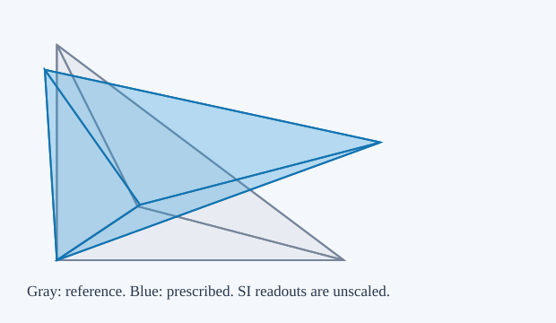
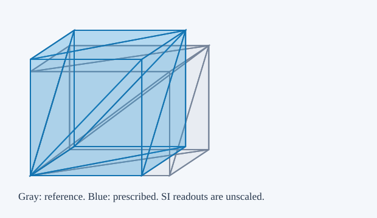
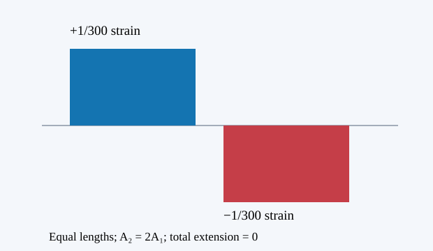

# Measure deformation before choosing a muscle law

These progressive property lessons separate geometry, constitutive response and equilibrium. A shape that keeps its total volume can still have uneven local compression; a shape that looks muscular has not thereby passed a mechanical test. The anatomical capstone retains its failed cases and its force and geometry gates.

## 1. Measure a prescribed deformation

For reference vertices $X_i$ and current vertices $x_i$, each in metres, construct edge matrices $D_m=[X_1-X_0, X_2-X_0, X_3-X_0]$ and $D_s=[x_1-x_0,x_2-x_0,x_3-x_0]$. A nondegenerate, positively oriented reference is required. The affine deformation gradient, local volume ratio and Green strain are

$$F=D_sD_m^{-1},\qquad J=\det F,\qquad E_G=\frac12(F^TF-I).$$

Translation cancels from the edges. A rigid rotation has $E_G=0$; simple shear can have $J=1$ while $E_G\ne0$. Volume preservation does not mean absence of strain.

The independent measurement uses the oriented boundary triangles. For any common origin $o$, with outward face ordering,

$$V_{\partial}=\frac16\sum_{(a,b,c)}(a-o)\cdot[(b-a)\times(c-a)].$$

The browser computes this triangle sum without calling the determinant helper. It reports $V_{\partial}/V_{\partial,0}-J$, in dimensionless units, rather than assuming agreement. Negative signed volume or nonpositive $J$ rejects the candidate and retains the last valid displayed state. This four-node affine test does not certify curved P2 elements or a whole moving tissue envelope.

<section class="laboratory property-lesson" data-property="deformation" id="lab-property-deformation" aria-labelledby="property-deformation-heading"><h3 id="property-deformation-heading">Property lab 1 · Measure deformation</h3>
Declared reduced fixture; SI units; scope and assumptions in the adjacent derivation.
<figure class="static-figure"><figcaption>Authored 80 × 60 × 50 mm reference. Gray is reference; blue is prescribed geometry. This lesson imposes kinematics and does not solve force equilibrium.</figcaption></figure>

Authored 80 × 60 × 50 mm reference. Gray is reference; blue is prescribed geometry. This lesson imposes kinematics and does not solve force equilibrium.

<label for="property-deformation-sx">Axial stretch</label>
<input type="range" aria-label="Axial stretch slider" data-param="sx" min="0.4" max="1.7" step="0.01" value="1.2"><input id="property-deformation-sx" type="number" data-param="sx" min="0.4" max="1.7" step="0.01" value="1.2">

<label for="property-deformation-sy">Y stretch</label>
<input type="range" aria-label="Y stretch slider" data-param="sy" min="0.4" max="1.7" step="0.01" value="0.85"><input id="property-deformation-sy" type="number" data-param="sy" min="0.4" max="1.7" step="0.01" value="0.85">

<label for="property-deformation-sz">Z stretch</label>
<input type="range" aria-label="Z stretch slider" data-param="sz" min="0.4" max="1.7" step="0.01" value="1.03"><input id="property-deformation-sz" type="number" data-param="sz" min="0.4" max="1.7" step="0.01" value="1.03">

<label for="property-deformation-shear">Simple shear</label>
<input type="range" aria-label="Simple shear slider" data-param="shear" min="-0.8" max="0.8" step="0.01" value="0.25"><input id="property-deformation-shear" type="number" data-param="shear" min="-0.8" max="0.8" step="0.01" value="0.25">

<label for="property-deformation-angle">Rotation (degrees)</label>
<input type="range" aria-label="Rotation (degrees) slider" data-param="angle" min="-180" max="180" step="1" value="20"><input id="property-deformation-angle" type="number" data-param="angle" min="-180" max="180" step="1" value="20">

<label for="property-deformation-tx">Translation X (mm)</label>
<input type="range" aria-label="Translation X (mm) slider" data-param="tx" min="-50" max="50" step="1" value="0"><input id="property-deformation-tx" type="number" data-param="tx" min="-50" max="50" step="1" value="0">

<label for="property-deformation-ty">Translation Y (mm)</label>
<input type="range" aria-label="Translation Y (mm) slider" data-param="ty" min="-50" max="50" step="1" value="0"><input id="property-deformation-ty" type="number" data-param="ty" min="-50" max="50" step="1" value="0">

<label for="property-deformation-tz">Translation Z (mm)</label>
<input type="range" aria-label="Translation Z (mm) slider" data-param="tz" min="-50" max="50" step="1" value="0"><input id="property-deformation-tz" type="number" data-param="tz" min="-50" max="50" step="1" value="0">

<button type="button" data-action="reset">Reset</button><button type="button" data-action="invert">Try inverted candidate</button><button type="button" data-action="summary">Read current results</button><button type="button" data-action="copy">Copy state</button>
<dl class="readout" aria-label="Measured kinematics"></dl>

<textarea class="preset" aria-label="Reproducible kinematics JSON" readonly hidden></textarea><noscript>Interactive controls require JavaScript. The static illustration and equations remain available.</noscript></section>

**Proposed exact claim volume-edge-translation (not yet kernel-qualified in this preview):** Adding one real translation to all four vertices leaves the tetrahedral edge matrix unchanged.

**Assumptions:** Four real three-dimensional vertex vectors; the same translation acts on each vertex. A meaningful physical deformation gradient additionally requires a nondegenerate reference tetrahedron.

**Limits:** No floating-point equivalence, boundary triangulation, inversion detection, equilibrium or biological claim is established.

**Proposed exact claim volume-det-compose (not yet kernel-qualified in this preview):** The determinant of a product of real 3 by 3 matrices is the product of their determinants.

**Assumptions:** Real square matrices; this supports F=Ds*inverse(Dm) with separately assumed invertible reference geometry.

**Limits:** Does not certify JavaScript matrix multiplication/inversion, mesh orientation or boundary measurements.

## 2. Exact isochoric kinematics

Prescribe $F=\operatorname{diag}(\lambda,b,b)$ with positive dimensionless stretches. Then $J=\lambda b^2$. In the isochoric construction $b=1/\sqrt\lambda$, so $J=1$ in exact real arithmetic. The interactive controls also allow independent stretches, which need not preserve volume. This is a kinematic construction, not a minimization or a muscle contraction law.

For the rectangular reference, $L=\lambda L_0$, $A=b^2A_0$ and $AL=JV_0$. Cross-section area is the area normal to the axial direction, measured from two transverse edges. Exterior area is the sum of all boundary-triangle areas. They have the same units, square metres, but different mechanical meanings. Neither is automatically physiological cross-sectional area (PCSA). The independent boundary-volume measurement remains visible when the isochoric toggle is selected.

<section class="laboratory property-lesson" data-property="isochoric" id="lab-property-isochoric" aria-labelledby="property-isochoric-heading"><h3 id="property-isochoric-heading">Property lab 2 · Volume and cross-section</h3>
Declared reduced fixture; SI units; scope and assumptions in the adjacent derivation.
<figure class="static-figure"><figcaption>Authored 80 × 60 × 50 mm reference. Gray is reference; blue is prescribed geometry. This lesson imposes kinematics and does not solve force equilibrium.</figcaption></figure>

Authored 80 × 60 × 50 mm reference. Gray is reference; blue is prescribed geometry. This lesson imposes kinematics and does not solve force equilibrium.

<label for="property-isochoric-axial">Axial stretch</label>
<input type="range" aria-label="Axial stretch slider" data-param="axial" min="0.4" max="1.7" step="0.01" value="0.8"><input id="property-isochoric-axial" type="number" data-param="axial" min="0.4" max="1.7" step="0.01" value="0.8">

<label for="property-isochoric-lateral">Independent lateral stretch</label>
<input type="range" aria-label="Independent lateral stretch slider" data-param="lateral" min="0.4" max="1.7" step="0.01" value="1"><input id="property-isochoric-lateral" type="number" data-param="lateral" min="0.4" max="1.7" step="0.01" value="1">

<label for="property-iso-mode">Stretch relation</label><select id="property-iso-mode" data-param="mode"><option value="isochoric">Isochoric: b = 1 / sqrt(axial)</option><option value="independent">Independent stretches</option></select>

<button type="button" data-action="reset">Reset</button><button type="button" data-action="summary">Read current results</button><button type="button" data-action="copy">Copy state</button>
<dl class="readout" aria-label="Measured kinematics"></dl>

<textarea class="preset" aria-label="Reproducible kinematics JSON" readonly hidden></textarea><noscript>Interactive controls require JavaScript. The static illustration and equations remain available.</noscript></section>

**Proposed exact claim volume-diagonal (not yet kernel-qualified in this preview):** The real axial/lateral diagonal deformation diag(lambda,b,b) has determinant lambda*b*b.

**Assumptions:** Real stretches; physical use additionally requires lambda>0 and b>0. Unit determinant follows whenever the stated product equals one.

**Limits:** A kinematic identity; no force equilibrium, finite-bulk incompressibility, material response or biological correctness follows.

**Proposed exact claim volume-isochoric-sqrt (not yet kernel-qualified in this preview):** For real lambda>0, b=1/sqrt(lambda) is positive and diag(lambda,b,b) has unit determinant.

**Assumptions:** Positive real axial stretch and the exact real square-root construction.

**Limits:** Does not prove binary64 sqrt/division or measured browser volume is exact, and does not establish a passive or active equilibrium.

## 3. Nonuniform cross-section: a reduced axial oracle

Take a small-strain bar with length $L$ in metres, positive area $A(s)$ in square metres, constant modulus $E$ in pascals, no distributed axial load, and a tensile-positive resultant $N$ in newtons. Force balance gives $dN/ds=0$. The passive law gives $\epsilon(s)=N/[EA(s)]$, so

$$\Delta L=\int_0^L\epsilon(s)\,ds=N\int_0^L\frac{ds}{EA(s)}.$$

For linear **area** taper $A(s)=A_1[1+(r-1)s/L]$, the exact compliance is $L\ln(r)/[EA_1(r-1)]$, with limit $L/(EA_1)$ at $r=1$. Numerical midpoint integration is compared with that analytic integral. Linear area taper is a separate geometric assumption from a radius taper. The exterior surface influences surface traction and contact; it does not replace $A(s)$ in this axial law.

Add a separately declared uniform active-stress offset $a\sigma_0$, still under this reduced small-strain law: $\epsilon=N/(EA)-a\sigma_0/E$. With both ends fixed, $\int\epsilon ds=0$ determines the constant $N$. Two equal-length segments with $A_2=2A_1$ and $a\sigma_0/E=0.01$ give $N=(4/3)A_1a\sigma_0$, narrow strain $+1/300$ and wide strain $-1/300$. Local extension and compression coexist even though total length is fixed. This offset model has no force–length/velocity dependence, transverse equilibrium, pennation, ECM, fluid or anatomical calibration; it is not a complete active muscle model.

<section class="laboratory property-lesson" data-property="tapered" id="lab-property-tapered" aria-labelledby="property-tapered-heading"><h3 id="property-tapered-heading">Property lab 3 · Uneven axial strain</h3>
Declared reduced fixture; SI units; scope and assumptions in the adjacent derivation.
<figure class="static-figure"><figcaption>Small-strain constant-modulus bar; no distributed axial load. Strain by axial position, with blue extension and red compression. Area controls an axial resultant, not a complete muscle law.</figcaption></figure>

Small-strain constant-modulus bar; no distributed axial load. Strain by axial position, with blue extension and red compression. Area controls an axial resultant, not a complete muscle law.

<label for="property-tapered-length">Reference length (m)</label>
<input type="range" aria-label="Reference length (m) slider" data-param="length" min="0.05" max="0.5" step="0.01" value="0.2"><input id="property-tapered-length" type="number" data-param="length" min="0.05" max="0.5" step="0.01" value="0.2">

<label for="property-tapered-area">Narrow area (m²)</label>
<input type="range" aria-label="Narrow area (m²) slider" data-param="area" min="0.0001" max="0.001" step="0.0001" value="0.0003"><input id="property-tapered-area" type="number" data-param="area" min="0.0001" max="0.001" step="0.0001" value="0.0003">

<label for="property-tapered-ratio">End area ratio</label>
<input type="range" aria-label="End area ratio slider" data-param="ratio" min="0.5" max="4" step="0.1" value="2"><input id="property-tapered-ratio" type="number" data-param="ratio" min="0.5" max="4" step="0.1" value="2">

<label for="property-tapered-modulus">Modulus E (Pa)</label>
<input type="range" aria-label="Modulus E (Pa) slider" data-param="modulus" min="50000" max="500000" step="10000" value="100000"><input id="property-tapered-modulus" type="number" data-param="modulus" min="50000" max="500000" step="10000" value="100000">

<label for="property-tapered-force">Passive tensile force (N)</label>
<input type="range" aria-label="Passive tensile force (N) slider" data-param="force" min="-1" max="1" step="0.1" value="0.3"><input id="property-tapered-force" type="number" data-param="force" min="-1" max="1" step="0.1" value="0.3">

<label for="property-tapered-activeStress">Active stress offset (Pa)</label>
<input type="range" aria-label="Active stress offset (Pa) slider" data-param="activeStress" min="0" max="2000" step="100" value="1000"><input id="property-tapered-activeStress" type="number" data-param="activeStress" min="0" max="2000" step="100" value="1000">

<label for="property-tapered-activation">Activation fraction</label>
<input type="range" aria-label="Activation fraction slider" data-param="activation" min="0" max="1" step="0.05" value="1"><input id="property-tapered-activation" type="number" data-param="activation" min="0" max="1" step="0.05" value="1">

<label for="property-tapered-mode">Boundary / load condition</label><select id="property-tapered-mode" data-param="mode"><option value="passive">Prescribed passive force</option><option value="active-fixed">Uniform active stress; fixed ends</option></select>

<label for="property-tapered-shape">Area profile</label><select id="property-tapered-shape" data-param="shape"><option value="linear">Linear area taper</option><option value="two-segment">Two equal-length segments</option></select>

<label for="property-tapered-segments">Midpoint cells</label><select id="property-tapered-segments" data-param="segments"><option value="8">8</option><option value="16" selected>16</option><option value="32">32</option><option value="64">64</option><option value="128">128</option></select>

<button type="button" data-action="reset">Reset</button><button type="button" data-action="summary">Read current results</button><button type="button" data-action="copy">Copy state</button>
<dl class="readout" aria-label="Measured kinematics"></dl>

<textarea class="preset" aria-label="Reproducible kinematics JSON" readonly hidden></textarea><noscript>Interactive controls require JavaScript. The static illustration and equations remain available.</noscript></section>

The executable oracle is [the tapered-bar module](web/tapered-bar.mjs). Tests check the logarithmic integral, refinement and the two-segment fixed-end case. Its scope is numerical evidence for this declared reduced law; the kinematic Lean claims above do not prove its mechanics.

## What the exact claims cover

The proposed real-number proof source targets edge translation invariance, determinant composition, the actual diagonal determinant and the positive square-root isochoric construction. These four declarations await fresh kernel compilation against the pinned mathlib dependency. They must not be displayed as checked proof cards until that succeeds. Separate numerical and browser tests cover the implemented controls and boundary measurements. Neither class of test validates measured biological parameters or resolves the capstone's local compression and full nodal stationarity failures.
