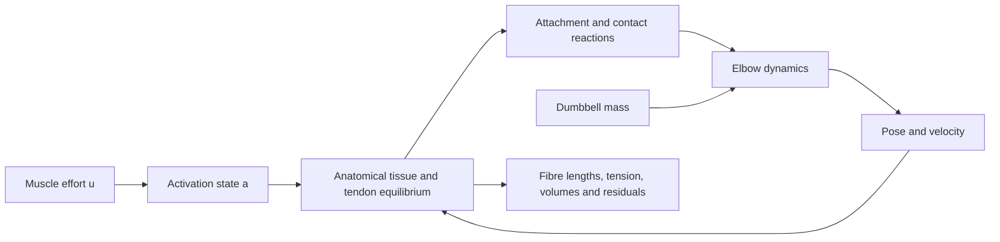

# Reopened anatomical capstone: gap audit and implementation outline

**Status: capstone acceptance reopened.** The current Lab 7 is not an adequate anatomical arm for the corrected requirement. The working mobile renderer and existing toy-model tests do not settle that requirement. The principal failures are tissue topology, attachment boundaries, and force ownership, alongside missing muscle constitutive behavior. Schematic labeling does not remedy those failures. This is an audit and proposed implementation contract, not a completed anatomical replacement.

Audited baseline: main `ea2fadfe7c3940e73a0a8b47609ff2875ca73842`, tree `96376118480f7b03c6667b1516508ea2077a7418`. The separate touch-diagnostics branch is preserved. All anatomy assets, existing book chapters, mechanics modules, and checked Lean sources remain unchanged in this audit milestone. Production simulator plans remain separate.

## 1. Current implementation versus the requested arm

The code references below are repository-relative. The companion `tools/capstone-gap-audit.mjs` executes the current equations and emits source hashes; its receipt is a diagnosis of these equations, not validation of anatomical predictions.

| System | What the current implementation actually does | Gap and corrective class |
|:--|:--|:--|
| Skeleton and joint | `web/advanced.mjs:renderScene` draws two cylinders and endpoint spheres. `spatial.mjs:capsuleGap` uses two capsules meeting at one origin. There are no separate radius/ulna shapes, articular landmarks, or anatomical joint-axis registration. | **Geometry/rig.** Use distinct humerus, radius, and ulna meshes in their shared atlas coordinates; define and review the elbow axis and fixed shoulder/supination frame. One flexion DOF can remain a declared bounded simplification. Anatomical bones do not require cartilage/contact mechanics merely to be shown correctly. |
| Muscle body | `makeSpatial` constructs one 38 × 360 × 42 mm strip with 81 core vertices and 192 tetrahedra, extending from y = 240 mm to −120 mm beside the hinge. This is continuous tissue across the elbow, rather than separate bellies terminating in their own tendinous structures. | **Topology/geometry.** Replace the strip with named belly volumes and separately identified tendon/aponeurosis regions. A prettier strip or a different stiffness cannot establish those regions. Retain the old strip only as an intermediate hinge-strip lesson if useful. |
| Attachments | Both complete end cross-sections are clamped to authored skinning transforms; 18 core nodes are fixed. There are no insertion patches, proximal attachment surfaces, tendon routing identities, or registration to bone landmarks. | **Boundary conditions and rig.** Provide distributed attachment patches in body-local frames, not generic full-section clamps. Audit proximal and distal topology for each head; include fixed shoulder-origin landmarks where needed. Do not transplant Arm26 coordinates into a different atlas without an explicit reviewed transform. |
| Fibres and tendon | Nine equal straight active chains occupy the first 180 mm of the strip. Nine bilateral spring edges then span 45 mm; passive strip continues beyond them. These edges are not documented anatomical distal tendons or aponeuroses. | **Architecture and constitutive law.** Define a spatial fibre-direction field and distinct tendon/aponeurosis domains. Replace compressive tendon-spring behavior with a specified tensile/slack law. Surface geometry alone does not provide fibre directions or tendon material calibration. |
| Skin/fascia | The boundary of this one strip is offset radially by 4 mm to form a sheath, with membrane edges and one-to-one vector tethers. The comparison side renders the sheath even when skin is switched off. | **Wrong domain/interface.** Remove this sheath from the revised arm presentation. Defer arm skin until surrounding musculature, subcutaneous tissue/envelope, and sliding/contact interfaces exist. Internal aponeurosis or muscle-associated fascia is a separate structure; it must not be presented as external arm skin. |
| Muscle-force ownership | `spatialStep` calls `seriesStep` with its plate contact disabled. The synthetic scalar line supplies lifting torque. `spatialResults` solves tissue after receiving q and a, but discards its reactions for hinge evolution. Shape ablation does not change hinge muscle torque. | **Coupling defect.** The revised tissue/tendon solution must return forces to the skeleton. Remove this unrelated scalar lifting torque for the same represented muscles. Retain the line/series model as an earlier lesson and optional independent reference, not an additional capstone actuator. |
| Active/passive tissue | Active edges use an activation-dependent preferred length and stiffness. Passive edges and tetrahedral volume penalties give topology-dependent resistance. They do not specify an objective finite-strain fibre-reinforced continuum, force-length/velocity law, or subject calibration. | **Constitutive insufficiency.** Select one finite-strain tissue model, with declared active/passive stresses and near-incompressibility treatment. Geometry/attachment repair comes first; material sophistication cannot rescue wrong boundaries. |
| Contact and compression | Boundary vertices and tetrahedron centroids are tested against capsule proxies. Forces are not fed back to bones; sampled gaps do not exclude triangle intersections. The normal-force sum is neither cartilage joint compression nor pressure. | **Collision and coupling.** Contact must use reviewed collision geometry and whole-surface checks and contribute reaction forces once. Soft-tissue compression near elbow flexion and bone-joint reaction are separate outputs. No cartilage stress claim without its own joint/cartilage model. |
| Primary interaction | Three ranges (`load`, `excitation`, `angle`) plus eight selects and multiple experiment actions. Excitation changes preserve state and wait for stepping. A mass change pauses and silently restarts time, activation, and trajectory. | **Controller/teaching design.** Expose only muscle effort and dumbbell mass as primary sliders. Make angle, tendon tension, fibre state, and actual activation outputs. Put diagnostic controls in an advanced panel; retain explicit Reset and Release actions. |

## 2. Evidence that constrains the correction

Primary sources were checked on 2026-10-04 where accessible; the independent anatomy/mechanics reviewer supplied additional source-grounded findings. No paper figures or unlicensed meshes are copied.

- [Blemker, Pinsky and Delp (2005), original manuscript](https://nmbl.stanford.edu/publications/pdf/Blemker2005.pdf), §§2.1–2.3 and Figs. 1–3: explicit muscle belly/aponeurosis domains and a spatial fibre map underpin the 3D formulation. Its comparison concerns a particular low-load imaging task, not the present dumbbell model. The paper motivates architecture-dependent deformation; it does not supply a ready-to-use whole-arm rig. Independently opened in this audit.
- [Murray, Buchanan and Delp (2000), original manuscript](https://nmbl.stanford.edu/publications/pdf/Murray2000.pdf), §2 and Tables 2–3: measured architecture and tendon excursion vary across elbow muscles and specimens. This supports retaining muscle identity and parameter provenance rather than assigning one synthetic flexor to all bellies. Study summaries do not calibrate this atlas. Independently opened.
- [Ryan et al. (2020), original compression study](https://www.frontiersin.org/journals/physiology/articles/10.3389/fphys.2020.538522/full), introduction and methods: its isolated muscle block explicitly excludes tendon/aponeurosis influence. It informs a compression fixture; it cannot establish arm attachment topology. Independently opened and checked.
- [Pai et al. (2018), original Human Touch paper](https://www.cs.ubc.ca/research/HumanTouch/HumanTouchSIGGRAPH2018.pdf), §§2 and 5: its body-covering sliding tissue layer is a fitted phenomenological system. It supports separating the external envelope from individual muscle surfaces; its effective parameters are not anatomical skin thickness for this arm. Independently opened.
- [Arm26, pinned official model](https://github.com/opensim-org/opensim-models/blob/84b487c4e3245359a64381e01f01b9cf4772d457/Models/Arm26/arm26.osim): the retained XML has six named Thelen actuators, body-local path points, and a combined forearm/hand body. Its embedded CC BY 3.0 grant and original credits remain. It has no brachioradialis actuator and is not registered to BodyParts3D. Independent reference, not same-subject calibration; official source and retained XML checked.
- [Official BodyParts3D description](https://dbarchive.biosciencedbc.jp/en/bodyparts3d/desc.html) and [current licence](https://dbarchive.biosciencedbc.jp/en/bodyparts3d/lic.html): licensed reference geometry, current CC BY 4.0 grant. Existing original notices/provenance remain; licence and description independently checked. The repository contains distinct humerus/radius/ulna, both biceps heads, brachialis, brachioradialis, and three triceps heads. The current heavily reduced atlas surfaces are not automatically watertight collision or volume meshes.
- [Millard et al. (2013)](https://nmbl.stanford.edu/publications/pdf/Millard2013.pdf) supports the independent review's activation/force-length/velocity/tendon-equilibrium distinctions. Direct manuscript retrieval was blocked here; the [official authored OpenSim implementation](https://github.com/opensim-org/opensim-core/blob/main/OpenSim/Actuators/Millard2012EquilibriumMuscle.cpp) was independently read for active/passive/velocity and equilibrium terms. This moving source is a formulation reference, not a new executable dependency or an immutable implementation pin.
- Reviewer-supplied attachment references: [distal biceps cadaveric study](https://pubmed.ncbi.nlm.nih.gov/17473142/), [brachialis layered attachments](https://pubmed.ncbi.nlm.nih.gov/17545433/), and [elbow anatomy article](https://pmc.ncbi.nlm.nih.gov/articles/PMC8258984/). Retrieval was intermittent/blocked here; precise landmark/attachment extraction remains an implementation prerequisite with the independent reviewer, not a claim of fresh full-text verification. No attachment dimensions are invented from these links.

The normalized Multisensor recording presently shown in the book is neither a registered deformation dataset nor an individual-muscle force measurement. It cannot silently calibrate the revised muscle law. A high-resolution source acquisition, mesh repair, or geometric adaptation needs its own manifest, changed-asset notice, attribution, and independent anatomical check.

## 3. Executable findings on the existing load/contraction relationship

Run `node education/tools/capstone-gap-audit.mjs /tmp/kenoma-capstone-gap.json` from the repository. The probe uses actual imported mechanics, hashes its inputs, and leaves all defaults unchanged. These are authored-model values, not human measurements.

At q = 30°, a = 0.6 and zero angular velocity, the current line tension is 720 N and its muscle moment is 17.367712 N m for every tested mass. Increasing mass from 1 to 10 kg changes gravity moment from −2.820375 to −18.271125 N m and angular acceleration from 76.064508 to −0.698290 rad/s². Thus mass already changes scalar dynamics; saying the existing model has no load effect would be wrong. Identical instantaneous force at fixed activation/length is not itself evidence of a bad force law.

For the spatial solve at the identical q,a, skin off and 160 iterations, 0 and 10 kg produce bit-identical positions and energies: mass does not enter that spatial problem. Activating it does shorten its own centre fibre path, from 0.172584 to 0.164190 m in this fixture. These are different coordinates and a different force system from the scalar line. Turning off the spatial active term leaves the line lifting moment unchanged. These combined findings establish the missing return coupling, rather than merely showing a bad-looking mesh.

Starting at 30° with a = 0, 0.2 seconds of excitation 0.6 gives q ≈ 75.02°, 31.99°, and 24.02° for 1, 5, and 10 kg respectively. Shape can therefore depend indirectly on load through subsequent pose. Release reduces activation continuously on the next step. None of these successful toy behaviors validates anatomical attachments or loaded belly deformation.

A separate real DOM probe at a 393-pixel viewport verified the current three range controls using keyboard ArrowRight input. Excitation increases without changing stored state; four steps advance activation/time; increasing mass then resets time, activation and step index. The proposed two-slider controller is **not implemented yet**; passing these diagnosis checks is not a passing result for that proposed UI.

## 4. Bounded revised architecture

**First exposed-muscle milestone:** fixed shoulder and forearm supination; one elbow-flexion DOF; distinct anatomical bones; separate shaped flexors with tendon/aponeurosis attachment patches and surrounding passive antagonist support. Include both biceps heads and brachialis in the active implementation. Brachioradialis can be represented geometrically and mechanically passive until its active architecture/parameters are sourced; declare that omission. Include the triceps heads as anatomical passive support, with their attachment requirements, rather than pretending one input identifies physiological recruitment. Any shared-flexor excitation/recruitment mapping must be explicit and separately labeled an authored control assumption.

Use the atlas's common skeletal/muscle coordinates for geometric assembly. Determine an elbow axis, shoulder-fixed attachment frames, and distal load point from reviewed landmarks. Obtain sufficient resolution before remeshing muscle volumes; preserve each muscle's source identity and topology. Do not bend an entire belly around the hinge as a uniform strip. Tendons may route around reviewed bone surfaces, with their own domains and attachments.

The tissue solution owns the muscle action. At each permitted pose and activation state, solve active/passive finite-strain muscle and tensile tendon equilibrium, return distributed attachment and contact reactions, assemble their generalized elbow force, and advance the loaded rigid-body coordinate. A partitioned implicit/quasistatic tissue solve with a safeguarded outer pose solve is a bounded starting point; report both tissue residual and coupled force/time-step defect. A single lagged tissue evaluation is not silently a converged coupled solve.

Omit tissue inertia in this first quasistatic formulation explicitly. Segment mass/inertia must consistently include or exclude represented tissue mass so it is not counted twice. Include tissue gravity or justify/label its omission. Fixed shoulder/locked forearm coordinates imply support reactions, not free motion of an unconstrained arm. Cartilage, ligaments, whole-body control and injury inference are outside this bounded first milestone.

Skin is deferred. The naive skinning comparison initially uses **the same individual muscle/tendon geometry** at the same computed pose, camera and scale, with anatomical attachment boundaries. It compares deformation prescriptions; it must not show an invented external sheath or imply that one muscle surface is the skin of an arm.

## 5. Equations and state variables requiring revision

### Tissue state, finite strain, and constitutive choice

Add per-domain reference coordinates X, current nodal x, deformation gradient **F** = ∂x/∂X, J = det F > 0, reference unit fibre direction f₀(X), current direction f = Ff₀/‖Ff₀‖, and fibre stretch λ_f = ‖Ff₀‖. Keep notation distinct from tendon force F_T. Near-incompressibility is a continuum constraint/constitutive choice, not merely rescaling a rendered radius.

Specify passive strain-energy density Ψ_pas(F,f₀,J) in Pa, passive first Piola stress P_pas = ∂Ψ_pas/∂F, and an active stress such as σ_act = a σ₀ f_L(λ_f) f_V(λ̇_f) f⊗f. This is a **proposed contract form**, not a selected calibrated law: specify normalization, stress measure, reference area/optimal stretch, functions and admissible domain before implementation. Convert active stress consistently, P_act = J σ_act F⁻ᵀ. Choose active stress or an active-strain formulation, not both as duplicate actuators.

For the initial quasistatic force-length version, explicitly set aside physiological force-velocity/transient-speed claims. Add and independently verify a sourced velocity dependence before making those claims. An activation-dependent potential used to solve a fixed-a problem is not automatically stored passive energy; active power must be tracked separately.

Replace per-edge constants with documented continuum properties and a discretization whose response can be studied under mesh refinement. A large bulk penalty on linear tetrahedra risks locking; select and test an appropriate mixed, stabilized or otherwise justified treatment. The existing small-strain FEM chapter remains a basic reference fixture, not a finite-rotation muscle solver. Rigid-rotation objectivity, distorted-element behavior and near-incompressible conditioning need explicit checks.

### Tendon, attachment transfer, joint evolution and work

Use a specified tensile law F_T = A₀ P_T(ε_T), with reference area A₀ and nominal axial stress P_T, including slack/toe behavior and energy consistently; ε_T = (l_T−l_slack)/l_slack. If using Cauchy stress instead, use the current area. Distributed tendinous regions also require their actual stress/geometry. Use l_MT = l_T + l_f cos α only where that lumped architecture approximation is declared; a 3D field need not be forced into that identity globally.

For each bone-bound attachment or contact point x_b(q), define its kinematic Jacobian B_b = ∂x_b/∂q. If f_b is the force **on the bone**, generalized force is Q_tissue = Σ B_bᵀ f_b, and virtual power is Q_tissue q̇ = Σ f_b·ẋ_b. Specify opposite tissue-side reactions and signs. Area/quadrature weights and force distributions must preserve resultant, moment and power. The Jacobian B is distinct from volume ratio J. A path reference still has r = −∂l_MT/∂q and Q = rF_T; it is an independent comparison, not an extra lifting moment.

Advance M(q;m_D)q̈ + C(q,q̇) + G(q;m_D) = Q_tissue + Q_other − Dq̇, where Q_other contains only genuinely different actuators/supports. For one fixed-axis coordinate, the scalar inertia may be constant under the chosen body model; derive it from segment inertias, centre-of-mass transforms, load point and dumbbell inertia rather than retaining arbitrary capstone dimensions silently. Remove the `seriesResults(...).muscleTorque` contribution for muscles represented by active tissue.

Keep u_i (excitation), a_i (activation), q, q̇, nodal tissue/tendon state, contact/attachment reactions, convergence residuals, and cumulative active work/dissipation. For piecewise constant u, the existing exact first-order update can remain if that activation model is deliberately chosen; its rise/fall parameters still need sourced/model-specific provenance. Release sets u to zero and preserves a,q,q̇ and admissible tissue state.

Mechanical energy is rigid kinetic plus gravitational potential plus passive tissue/tendon storage. Monitor ΔE_mech − W_active − W_external + D_diss with integration/tissue-solve defects. Count muscle work and contact transfer once. A mass-slider change is an externally imposed parameter event: preserve motion but record the discrete energy change due to mass replacement; do not disguise it as biological work or silently reset the arm. Contact force sums are not pressure unless surface traction/area integration is implemented.

## 6. Verified two-slider contract and required behavior

The diagnostic script verifies that both proposed keys already exist and that they have distinct roles in the current equations. The revised interaction still requires implementation and native mobile/keyboard verification.

| Primary slider | Mapping | Required visible outputs/behavior |
|:--|:--|:--|
| **Muscle effort** (0–1, unit 1) | Requested excitation u for the explicit flexor control mapping; show current actual a. Do not call it a direct tension setting in N. | During Play, changing effort preserves q,q̇,time and lets activation/tendon/tissue evolve. When paused, identify it as queued until Step. Release sets u = 0 continuously. Tension may persist, fibres can shorten, hold, or lengthen under load. |
| **Dumbbell mass** (kg) | m_D enters load gravity and inertia at the reviewed grip/load frame. Existing 0–10 kg range is an educational starting range, not a sourced clinical limit. | Increasing mass changes actual acceleration and ensuing force/length equilibrium, not a separate bulge amplitude. Preserve current state and record the mass-change energy event. A sufficiently heavy load may lower the arm while muscles remain active. |

Angle and deformation are outputs in the default force-driven mode. A prescribed hold belongs in an advanced experiment and must expose its external support moment. Keep Reset, Play/Pause, Step, Release and a clearly labeled trace export; advanced solver/contact controls need not compete with the two primary sliders. Retain prominent real 3D failure handling, reset/replay, static/text alternatives, units and per-demo approximation labels.

Do not assert that a heavier load must always yield more bulging at identical q,a: posture, tendon compliance, operating lengths and velocity matter. Verify matched-state equations, then matched-input trajectories and held-angle cases. The acceptance evidence must show forces and work from the displayed tissue, rather than merely animate an activation-colored shape.

## 7. Book and proof impact

| Source chapter/file | Required revision when the new mechanics land |
|:--|:--|
| `00-scope.md`, `04-research-path.md`, `13-coverage.md` | Replace final-capstone acceptance/coverage language and state the new bounded anatomical and quasistatic scope, data provenance and unresolved validation. Preserve production-plan separation. |
| `01-force.md`, `02-torque.md`, `03-energy.md` | Preserve elementary teaching laws and examples; update only references leading to the revised capstone and its energy ownership. |
| `04-anatomy.md`, `08-actual-data.md` | Show reviewed bone frames, muscle identities, attachment patches and asset transformations. Keep model parameters, atlas geometry and recorded signals distinct; no same-subject claim. |
| `04-muscle-physiology.md` | Align implemented activation, active/passive stress, force-length/velocity assumptions and tendon equilibrium with the chosen model; distinguish omitted speed effects explicitly. |
| `05-elbow.md`, `07-tendon-tissue.md` | Preserve synthetic line and series lessons as intermediates. Explain why their scalar force ownership is replaced in the anatomical capstone, not added to its tissue forces. |
| `06-tissue-graphics.md`, `10-fast-methods.md` | Use the same assembled anatomy for the naive weighting comparison; distinguish mechanical tissue from geometric skinning. Retain actual error/approximation labels and defer external skin. |
| `09-continuum-medical.md` | Add finite-strain fibre formulation, material choice, incompressibility/locking control and reference-vs-fast validation boundaries. Preserve the earlier small-strain fixture and its limited tests. |
| `11-interfaces.md` | Add distributed attachment/contact transpose transfer, bone reactions and the one-work-owner energy contract. |
| `12-spatial-capstone.md` | Rewrite around assembled arm, source-backed attachments, actual tissue-driven lift/release, two-slider contract and regenerated compression/skin-weighting experiments. Archive or relocate the old strip lesson; do not carry its worked values into the new model. |
| `05-sources.md`, `book/book.json`, `tools/build.py`, `tools/spatial-experiment.mjs`, `tools/spatial_figures.py`, browser/artifact tests | Update source claims, chapter ordering/anchors as needed, controls, generated figures/tables, units and test contracts together. Rebuild one canonical Markdown source, HTML and illustrated PDF after the scientific revision. |

Existing `proofs/Mechanics.lean` stays intact in this audit. The six elementary claims (`force-pair`, `torque-linearity`, `torque-origin`, `central-pair`, `kinetic-sign`, `torque-example`) remain valid exact-integer lessons; none establishes anatomical correctness. `activation-bound` remains a normalized-mixture numerator contract, not an exponential or physiology proof. `virtual-power` remains a scalar multiplication identity, not a proof of a new attachment Jacobian. `element-resultant` remains relevant only where the stated partition-of-gradient contract is implemented. `centroid-transfer` must remain with the old equal-quarter centroid lesson or be replaced at the new contact claim if sampling changes. `compliance-denominator` belongs to its regularized constraint lesson, not a mixed incompressibility guarantee. `armijo-decrease` belongs only where its actual acceptance contract applies; a new residual/Newton solver does not inherit L-BFGS convergence.

Add narrowly scoped, actually compiled transfer/resultant/work identities for the implemented distributed mapping, for example a finite-dimensional exact-scaled dot-product identity `(Bᵀf)·v = f·(Bv)` and paired transfer-work cancellation. Specify scales and domains. Update `proofs/claims.json`, precise chapter insertion points and check receipts together. These proposed identities are not currently implemented or checked; do not create a green biological/float-validation badge for them. Continuum objectivity, stress derivatives, solver precision and biological fit require their own numerical/experimental evidence.

## 8. Implementation milestones and acceptance evidence

1. **Anatomical assembly and review:** verify asset resolution/licence, common axes, distinct bones, shoulder/elbow frames, named bellies, tendon/aponeurosis regions and attachment patches. Review multiple flexion poses and front/oblique views. No skin sheath. Block anatomical acceptance on missing landmark or architecture evidence, not on a demand for patient-level accuracy.
2. **Muscle/tendon fixture:** implement the selected finite-strain formulation before a full curl. Independently check objectivity, energy/stress gradients, passive return, volume per muscle, tensile slack, fixed-end activation tension, free/loaded shortening, and release. Test mesh/solver sensitivity and locking behavior without retuning parameters between resolutions.
3. **Coupled loaded arm:** return actual tissue insertion/contact reactions; verify resultant, moment, power and single-work accounting. Disable/remove scalar duplicate torque. Test zero/positive mass, equal-state controls, load-dependent trajectories, hold support, activation-on lengthening and admissible-domain failure. Verify contact surface intersections and residuals across the supported range; capsule point gaps alone are insufficient.
4. **Two-slider mobile lesson and comparison:** implement native range/numeric synchronization, keyboard/touch input, state preservation, explicit mass event, deterministic reset, Release and failure recovery. Compare weighting on identical anatomical bind geometry and pose. Preserve all earlier elementary labs.
5. **Coherent edition:** revise the listed chapters, compile all retained/new Lean claims, regenerate experiments and figures, build Markdown/Pages/PDF from one source, visually review every PDF page and relevant mobile poses, then independent anatomy/mechanics review before capstone acceptance or publication.

At the time of this audit, attachment/architecture and constitutive choices remained open. Subsequent anatomy and mechanics review supplied the concrete engineering specification in [anatomical-capstone-specification.md](anatomical-capstone-specification.md), and implementation is proceeding with recorded atlas-derived selections and labeled authored approximations. Patient-specific calibration and optional shoulder meshes are not prerequisites. The audit diagnoses the previous capstone; it does not certify the replacement, which still requires the staged numerical and anatomical acceptance evidence above.
