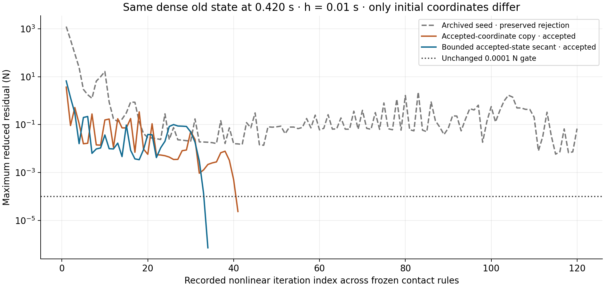

# Bounded accepted-state predictor: fixed-state result

Both newly executed initialization controls pass fresh independent force/geometry replay for the difficult 0.420→0.430 s increment. A reusable bounded accepted-state secant takes 34 iterations; the zero-order control copying the old accepted coordinates takes 41. The preserved archived-seed execution remains rejected after 120 iterations. This is numerical initialization progress in the existing reduced model, not physical calibration or convergence acceptance.

All controls use the exact retained dense old coordinates, angle **39.23034852102279 degrees**, angular velocity, activation, 0.5 kg load and contact recipe at **0.42000000000000026 s**. The requested increment remains 0.01 s at zero effort. The 256-point body integration, 460-coordinate space, constitutive/contact laws, Newton implementation, 0.0001 N force gate, finite geometry checks and 120-iteration ceiling per frozen contact rule are unchanged. The new runs assert accepted-input immutability. No witness is added in either new solve.

| Initialization from that same physical old state | Recorded iterations | Independent final reduced residual (N) | Outcome |
| --- | ---: | ---: | --- |
| Original archived coarse target guess | 120 | 0.06832677997711717 | Preserved rejection; no advancement |
| Old accepted coordinates copied, zero-order control | 41 | 2.381251583145655e-5 | Accepted and freshly replayed |
| Bounded accepted-state secant, new helper | 34 | 7.281126307931169e-7 | Accepted and freshly replayed |
| Earlier manually constructed same-state secant | 34 | 7.281126307931169e-7 | Previous independent execution retained |

The predictor caps extrapolation at one previous accepted increment. Its cap is inactive on this equal-increment case, so its initial coordinates exactly reproduce the earlier successful secant guess at **38.3718281018385 degrees**. The complete 34-iteration trace and every recorded physical endpoint field also reproduce that prior deterministic case exactly. This is a source-bound reproducibility result, not an independent statistical sample of general robustness.

The helper accepts only finite history with consecutive step/time lineage; it copies the current state when history is insufficient or mass is discontinuous and rejects malformed/overflowing inputs. Six focused tests cover these behaviors and input immutability. It returns initial coordinates and metadata only; the mechanics solver retains exclusive responsibility for physical acceptance and advancement. The helper is under `tools/`, with no production/browser integration in this milestone.

The two newly accepted endpoints occur at **0.43000000000000027 s**. Predictor angle is **38.25633035900602 degrees**; copy-control angle is **38.256330358851635 degrees**. Copy minus predictor is **−1.5439048534760204e-10 degrees**, and maximum actual P2 tissue-node difference is **2.266979588012361e-7 m**, about **0.227 micrometres**. Minimum corner determinants are 0.9652340566967442 and 0.9652340566932821 respectively. Fresh replay confirms independent full-P2 body-force projection into the same reduced space, time/activation/velocity lineage, zero recorded transverse crossings, routing and zero sampled muscle/bone, muscle/muscle and tendon/bone penetrations. These observations do not bound the missing full-nodal error.

## Compare the separate common-state interval correctly

The [common-state interval control](dense-release-common-state-control.md) starts from a different physical old state, the accepted coarse endpoint at 0.400 s. One coarse step used seven iterations; three fine steps used 76, 26 and 59 iterations, including six additional contact witnesses and two frozen rules for the first fine substep. Both intervals freshly passed. Their matched endpoint differences remain **0.2737069941238718 degrees / 0.0005957758504728777 m**. Those histories, increments, explicit guesses and adaptive contact rules differ from the present fixed-state initialization comparison; their costs and endpoint differences cannot be attributed solely to initialization or subtracted to identify a causal error contribution.

The original archived-seed failure, same-state retry, completed 35-state successor and all common-state evidence at `8bb4217d94d6791bfc3af9f68304083fc1b2e3b3` remain unchanged. The newly accepted controls do not relabel the original rejected execution or advance its retained prefix.

## Result and remaining physical work

The evidence supports using accepted dense history for initial guesses in the research author path rather than importing a distant archived coarse pose. Both zero-order copying and the secant solve this fixed increment under the original budget. The secant's seven fewer iterations in this case do not justify a universal performance claim or a larger iteration budget. The previous verified negative contact curvature and the difficult common-state trace still motivate a separate bounded negative-curvature solver experiment if broader predictor controls remain unreliable. No contact curvature or physical constraint is removed here.

The complete dense release's real reversal **42.71109785227619→38.25633035900602 degrees** remains numerically replayed. Its **4.721379394298936-degree / 0.0074036776038493915-m** coarse/fine matched-time discrepancy and common loading-prefix **J=0.7120247523019865** remain unresolved. Full nodal equilibrium, spatial/quadrature/timestep convergence, anatomical calibration and whole-envelope credibility remain unqualified. Improved initialization does not validate those outcomes or justify skin.

The separate [fiber/PCSA calibration outline](fiber-supplement/calibration-constraints-outline.md) distinguishes protein, count and area fractions; measured PCSA, geometric `V/L` and fitted `F/sigma0`; and the current active Cauchy stress from its reference coefficient. It binds only locally recorded verified evidence, leaves missing measured values explicit, and does not consume unverified coefficients. The [preliminary reviewer checkpoint](fiber-supplement/calibration-review-preliminary.json) preserves the parent's subsequently forwarded 32-point findings with explicit attribution, pending its final numerical receipt. The source identity was independently confirmed as Git blob `cc8e4ec12dbcaaf4eb53062af1e76fd520904d6e` at `8bb4217d`. Reported short/long biceps median stretches 0.5903/0.5630 and reference-volume-weighted active Cauchy means 0.473/0.535 MPa support distinguishing nonuniform fixed-end calibration from a uniform operating stress or simple units error. Those new reviewer metrics were not recomputed here. Stored calibration J minima were read locally from that unchanged `subdivided32` receipt and remain distinct from dense rechecks and the loaded trajectory. No preliminary estimate changes arm defaults.

Raw execution/replay/test/comparison/render logs and PNG/PDF evidence are under `review/dense-predictor-experiment/`. Executions are `audit/dense-predictor-bounded-secant.json` and `audit/dense-predictor-accepted-copy.json`, with distinct fresh `-recheck.json` files. The source-bound comparison is `audit/dense-predictor-comparison.json`. Wall times are not a controlled benchmark because other research processes remain active. No equation, book, Lean claim, production physics/solver, main/release, publication, Library transfer or material default changes in this milestone; finite-bulk `06e18acea7a8ae97d1d7f26fcec633119e137c77` remains preserved.
