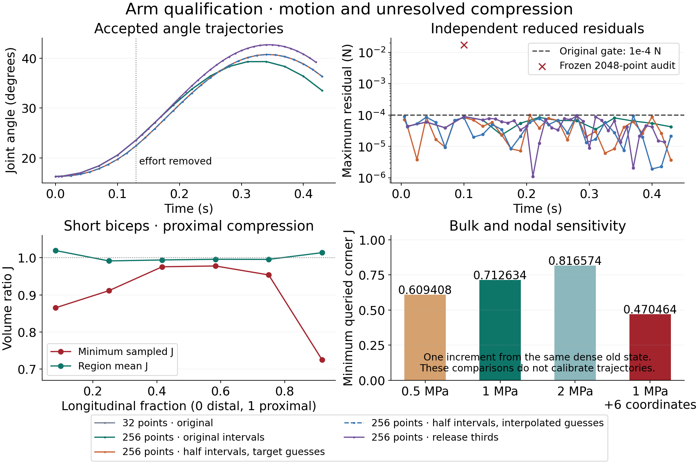

# Existing all-half refinement closeout

Both existing 256-point all-half trajectories have completed and passed fresh independent replay of all **30 accepted states**, through **0.43000000000000027 s**, under the unchanged **1e-4 N** stationarity gate. These are self-consistent denser reduced trajectories, not full-nodal, quadrature, timestep or anatomical convergence acceptance. No new optimizer run was started for this closeout.

| Existing experiment | Terminal execution / independent replay | Accepted states | Maximum independent reduced residual |
| --- | --- | ---: | ---: |
| All-half fine | `ACCEPTED_DENSE_TRAJECTORY` / `PASS_DENSE_TRAJECTORY` | 30 | 9.884085604687336e-5 N |
| All-half interpolated initialization | `ACCEPTED_DENSE_TRAJECTORY` / `PASS_DENSE_TRAJECTORY` | 30 | 9.611444654127835e-5 N |

Fine lift/release reverses **40.76270431384987→36.37554967676739 degrees**, falling **4.387154637082488 degrees**. Its minimum integration-point determinant is **0.7237759980704086** and minimum corner determinant **0.70973738187981**, approximately **29.0% local compression**. Improved trajectory completion does not resolve bulk/compression credibility. The final independently assembled residual is **3.6771840794696566e-6 N**.

The fine execution retains its original **240 iterations per frozen contact rule**. Its 30 increments required 36 frozen rules and added 25 witnesses. On the last increment, the first rule converged in 76 iterations but exposed six missed contact witnesses (two body, four bone); the refined rule converged in 44 iterations with no further additions. This is the configured geometric refinement loop, not an increased iteration budget. State/time advanced only after final force and geometry acceptance. Recorded finite geometry, routing, surface and penetration checks were freshly replayed; their sampling/reduced-space limits remain explicit in the receipt.

The interpolated experiment changes starting guesses only; archived 32-point poses never replace accepted physical states. Its lift/release reverses **40.75473090920312→36.36735833530571 degrees**, falling **4.387372573897414 degrees**. Minimum integration-point/corner J are **0.723775997409705 / 0.7097373811221571**; final independent residual is **2.126278555276127e-5 N**. Its original 240-iteration-per-rule cap also remains unchanged: 37 frozen rules and 29 added witnesses across 30 increments. The final increment uses 62 iterations, six added witnesses (two body, four bone), then 49 iterations with no further additions.

## Matched-time evidence and remaining limitations

The already scheduled comparison returns `PASS_ACCEPTED_MATCHED_TIME_COMPARISON`. It requires freshly replayed accepted states, matching actual times, activation and load; it performs no state interpolation or optimization. Differences are physical P2 tissue-node positions, not merely reduced coordinate coefficients.

| Actual matched-time comparison | Matched states | Maximum absolute angle difference | Maximum actual tissue-node difference |
| --- | ---: | ---: | ---: |
| Fine versus 15-state dense coarse | 15 | 2.840598712060304 degrees | 0.004364574396236348 m |
| Interpolated versus dense coarse | 15 | 2.8324073705986224 degrees | 0.004351520880428784 m |
| Interpolated versus fine | 30 | 0.008357494516812405 degrees | 0.00694726288600314 m |

Both coarse/fine maxima occur at 0.430 s. The seed-comparison angle maximum occurs at 0.400 s and nodal maximum at 0.235 s. Small angle differences therefore do not establish agreement of tissue states. Different adaptive contact histories and initial guesses prevent attribution solely to timestep. These discrepancies and approximately 29% corner compression leave whole-envelope credibility, calibration and full-nodal/spatial/integration/time convergence unresolved.

The original release-only rejection and its **34 accepted states through 0.420 s** remain preserved and freshly replayed as `PASS_PRESERVED_REJECTION`; its rejected 0.430 s candidate does not advance the accepted trajectory. Later successful runs do not relabel that failure. The [fixed-coefficient prism, attachment and sheet-control plan](fixed-coefficient-calibration-control-plan.md) remains the next **unexecuted** diagnostic step, with original anatomy/mechanics source attribution and the distinction between active Cauchy stress and the fitted first-Piola coefficient. No coefficients, equations, book/Lean claims, teaching release or skin changed.

The existing finalizer completed its comparison and PNG/SVG render child commands, then exited 1 in its console-only summary: the legacy 32-point baseline comparison omits `executionResult`, which its summary indexes unconditionally. The exact original launcher and a reporting note are preserved. Successful artifact receipts and hash bindings were independently checked; no child command, replay or mechanics run was duplicated. The figure was visually inspected for legible labels and its explicit limitations. The console metadata failure does not alter accepted states or qualify convergence.

## Exact evidence

- Execution: `data/anatomical-arm-v1/audit/anatomical-dense-fine-trajectory.json`, SHA256 **2e4b37080685001f65fa8db47ccf2f66b29cba4967f6284a28cecf8ac5073b7c**.
- Fresh replay: `data/anatomical-arm-v1/audit/anatomical-dense-fine-trajectory-recheck.json`, SHA256 **69f5cd3277b721ed300cbd586b4e55e0e1c5a9a17c4d101abdd015a184d8df0b**; binds the exact execution above and verifier SHA256 **0de4ac35162ecf731ac3e35b206d6ec3f071c9bf2cc9430c4839e054168b6c17**.
- Interpolated execution/replay: `audit/anatomical-dense-interpolated-trajectory.json` SHA256 **b566fdae5d6fa65a9f092b78abf48b5d032f8857cc228873062acc9253d5f00d** / `-recheck.json` SHA256 **f33e1d5c7c7a89814ba73db967e77c3a97d787fad3076f0e01c905efe36a8613**.
- Matched-time receipt: `audit/anatomical-dense-matched-times.json`, SHA256 **e35c550c53d5465b4be7e695892a9bc86a2482cbf20445b1d8de223a19915547**, binds 17 inputs/tool files.
- Existing PNG/SVG and `render-receipt.json` bind 15 inputs and the exact renderer. PNG SHA256 **5ac70905e87e9f79d44616da30ec03fff84016c708ef0dadbfcff182233f684d**; SVG SHA256 **6198cc27743053d2142690ea7c3ab069e7cbed48b95fd3483b5d8c759b125027**.
- Raw execution, fresh replay, comparison and render logs are under `review/dense-qualification/`. `closeout-validation.txt` records read-only identity/gate validation and **95 earlier manifest bindings unchanged**. `all-half-closeout-manifest.json` binds the closeout files. The original mutable author worktree is left intact.

Both original nonlinear processes, their replay monitor and finalizer are now terminal. This is the bounded stopping checkpoint: no additional expensive sweep or optimizer retry is started. The teaching site was separately published by the parent and remains unchanged.

The complete staged whitespace check flags the existing renderer's SVG path-data spaces. Its raw output is preserved in `staged-whitespace-check.json`; all other staged files pass. The exact source-bound SVG bytes are retained rather than changing the render receipt. This formatting exception does not change any mechanics gate.
