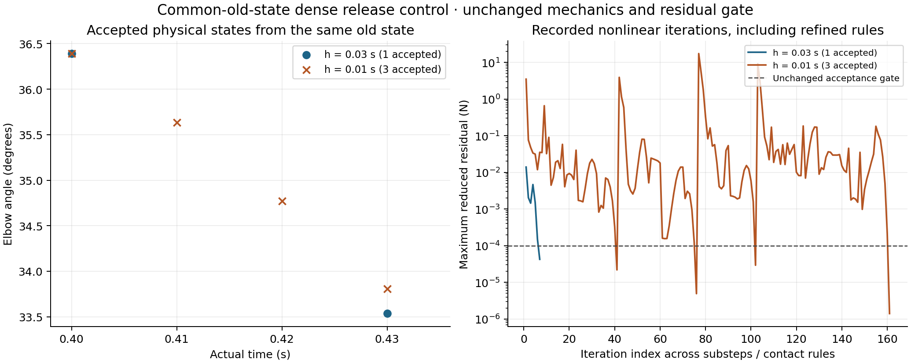

# Dense release: completed common-state control

The one-coarse-versus-three-fine interval from the exact same accepted physical old state now passes a fresh independent replay. This closes the diagnostic control left running in the [completed 35-state release checkpoint](dense-release-completed.md). It does not establish timestep convergence or whole-envelope credibility.

Both cases start from the coarse dense state at 0.40000000000000013 s, with exactly identical coordinates, angle, angular velocity, activation, 0.5 kg load and contact recipe. Both use 256 body points per element, the existing 460 coordinates, unchanged constitutive/contact laws, original Newton implementation, 0.0001 N stationarity gate and original finite geometry checks. Each frozen contact rule retains the 120-iteration ceiling and the existing contact-refinement limit. The coarse case uses its original archived 32-point initial guess; fine substeps use accepted-state secants. These seed choices are explicit.

| Common-old-state observation | One coarse step | Three fine steps |
| --- | ---: | ---: |
| Physical increment (s) | 0.03 | 0.01 |
| Accepted/replayed increments | 1 | 3 |
| Final actual time (s) | 0.43000000000000016 | 0.43000000000000016 |
| Final angle (degrees) | 33.534950964707086 | 33.808657958830956 |
| Maximum independent accepted reduced residual (N) | 4.248022990923023e-5 | 2.9325310196382653e-5 |
| Minimum accepted corner determinant | 0.9742469759549923 | 0.9703146398349959 |
| Total recorded nonlinear iterations across all rules | 7 | 161 |
| Newly added contact witnesses | 0 | 6 |

Every replayed state passes independent full-P2 body-force projection into the same reduced space, target-time/activation/velocity lineage, positive corner determinants, zero recorded transverse crossings, routing and zero sampled muscle/bone, muscle/muscle and tendon/bone penetrations. The source-bound summary additionally asserts exact equality of every physical field of the recomputed coarse endpoint with the archived coarse endpoint. The control does not interpolate or advance a rejected state.

At the common endpoint, fine minus coarse is **0.2737069941238718 degrees**, with maximum actual P2 tissue-node difference **0.0005957758504728777 m**. By comparison, the full release-refined trajectory differs by **4.721379394298936 degrees** and **0.0074036776038493915 m** at this same actual time. Different accumulated histories are consequential; however, the local control retains different explicit initial guesses and adaptively refined contact quadrature. The two discrepancies cannot be subtracted to assign a causal timestep/history error contribution.

## Contact refinement and bounded solve behavior

The first fine substep initially reaches 2.1901757884212154e-5 N in 41 iterations, but the geometric refiner finds six missing witnesses: two body samples and four reciprocal bone samples. Recorded examples concern brachioradialis FJ1487 and radius FJ3349, with signed distance approximately −7.4637e-5 m. That stationary candidate is not accepted or advanced. A second solve under the augmented contact rule takes 35 iterations and reaches 4.927672670909265e-6 N; only then do the geometry gates and physical advancement pass. The 76 iterations span two frozen rules, each below its original 120 limit. This is contact quadrature refinement under the existing potential, not a new material or contact law. It does not prove that the accepted coarse trajectory intersects between its frames.

The second fine substep accepts in 26 iterations at 2.9325310279178654e-5 N. The final fine substep accepts in 59 iterations at 1.4087847436853413e-6 N, independently reproduced as 1.4087844361327468e-6 N. Its trace includes a line-search step as small as 1/8192, substantial residual oscillations and regularization up to 100000 N/m. All of those observations remain in the raw receipt; no additional iteration budget or relaxed tolerance was supplied. The secant predictor is therefore useful but does not guarantee uniformly easy solves.

## Diagnosis and the next justified change

The [original preserved rejection](dense-release-rejection.md) remains a rejection: 120 iterations, 0.0683268 N, no geometry-gate failure or newly added witnesses, and no accepted state/time/contact advancement. Its verified negative reduced curvature is dominated by the muscle/bone distance potential, while body curvature along that mode is positive. The [isolated same-state retry](dense-release-secant-result.md), changing only its nonlinear initial guess, accepted in 34 iterations. That establishes feasibility of that increment under the existing recorded constraints and identifies starting-guess sensitivity in the nonconvex contact landscape as its immediate failure mechanism. It does not make bulk compression physiologically credible.

The justified next solver experiment is an accepted-state predictor in the dense author path, tested against the preserved archived-seed rejection and these common-state controls. Its success criterion must remain fresh force/geometry acceptance under the same budget. The slow common-state trace also justifies a separate bounded negative-curvature trust-region experiment if predictor performance remains unreliable; [Steihaug's original PCG/trust-region paper](https://epubs.siam.org/doi/10.1137/0720042) supplies the algorithmic basis. No contact Hessian term should be removed to make the operator positive. A further timestep-isolation control should use the same frozen union of independently discovered witnesses in both cases and report the remaining seed distinction; the present adaptive comparison cannot supply that isolation.

The full 35-state successor retains real release reversal **42.71109785227619→38.25633035900602 degrees**, but its common loading prefix still has corner J **0.7120247523019865**, approximately 28.8% local compression. The [dense bulk/calibration diagnosis](anatomical-dense-qualification.md) and [finite-bulk comparison](volume-penalty-comparison.md) remain separate evidence; this control neither selects a new volumetric penalty nor retunes a bulk modulus. Original anatomical provenance remains the licensed [BodyParts3D source meshes](../data/elbow-v1/sources/bodyparts3d/) and separately retained [Arm26 model parameters](../data/elbow-v1/sources/arm26.osim), not same-subject measurements. The earlier [primary-source anatomy/mechanics audit](anatomical-capstone-gap-audit.md) remains the source scope for architecture and compression assumptions.

No equation, book, Lean claim or production physics/solver file changes in this milestone. Finite-bulk `06e18acea7a8ae97d1d7f26fcec633119e137c77` and all previous diagnostic/successor manifests remain preserved. Full nodal equilibrium, spatial/quadrature/timestep convergence, anatomical calibration and whole-envelope credibility remain unqualified; skin remains deferred. Main/release and publication are owned by the parent and are unchanged by this research lane.

Execution, fresh replay and source-bound numerical summary are `audit/dense-controlled-release-interval.json`, `audit/dense-controlled-release-interval-recheck.json` and `audit/dense-controlled-release-interval-summary.json`. Raw execution/replay/summary/render logs, PNG/PDF renders and their hashes are under `review/dense-controlled-release-interval/`. The newly accepted interval is distinct from the preserved failed execution and the complete 35-state trajectory.
