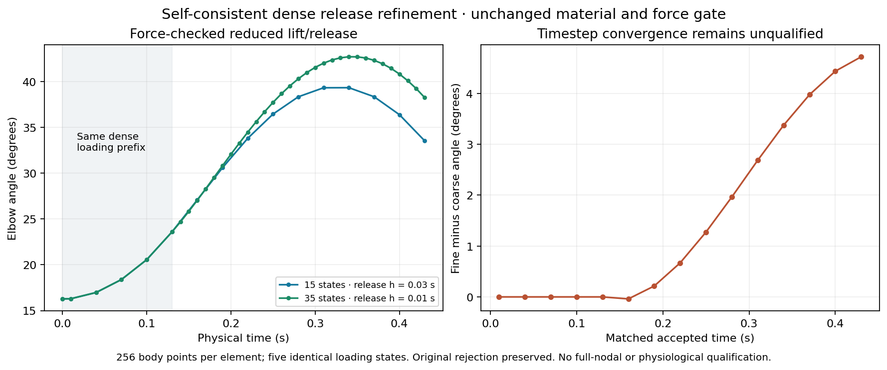

# Complete self-consistent dense release refinement

All 35 states of the separate release-refined successor pass a fresh complete replay. Body integration uses 256 points per element and the existing 460-coordinate space. The first five accepted dense loading increments are exactly the coarse run's states; only release intervals are divided into thirds. This is a self-consistent denser release trajectory, not full loading refinement or convergence acceptance.

The original run retained 34 accepted states and rejected its last increment after 120 iterations at 0.0683268 N. That failure, candidate, trace and rollback remain immutable. A separate retry of the exact same old state, using an accepted-state secant initial guess, accepted in 34 iterations at 7.2811e-7 N. Its fresh independent P2 projection/geometry replay passed. The successor joins that exact retained prefix and independently executed final step; a further fresh full replay checks all 35 force/geometry states, temporal lineage and mechanical-ledger arithmetic. No constitutive, residual, iteration-limit, production solver, book or Lean change was needed.

| Observed quantity | Coarse dense | Release-refined dense |
| --- | ---: | ---: |
| Accepted/replayed states | 15 | 35 |
| Release increment (s) | 0.03 | 0.01 |
| Maximum independent reduced residual (N) | 9.000557448879398e-5 | 9.44593552529684e-5 |
| Peak angle (degrees) | 39.33573834006891 | 42.71109785227619 |
| Final angle at 0.430 s (degrees) | 33.534950964707086 | 38.25633035900602 |
| Real fall from peak (degrees) | 5.800787375361821 | 4.454767493270162 |
| Final angular velocity (rad/s) | −1.6615033607996137 | −1.6999823901416078 |
| Minimum corner determinant | 0.7120247523019865 | 0.7120247523019865 |

Every coarse endpoint has an accepted refined state at the same actual physical time, activation and load. Maximum angle difference is 4.721379394298936°, and maximum actual P2 tissue-node position difference is 0.0074036776038493915 m; both maxima occur at 0.430 s. Passing stationarity at both discretizations does not establish temporal accuracy. The common loading prefix retains the approximately 28.8% local compression, so the bulk/envelope credibility problem remains.

The [frozen diagnostic](dense-release-rejection.md) identifies the rejected candidate's verified negative muscle/bone contact curvature. The [successful same-state retry](dense-release-secant-result.md) shows that the timestep and recorded geometry constraints were feasible under the existing model; starting-guess sensitivity through the nonconvex contact landscape was the immediate failure mechanism. Accepted-state predictors are a justified next initialization experiment, rather than increasing iteration budgets or removing physical contact curvature. The controlled one-coarse-versus-three-fine interval from a single old state remains separate and is still running at this checkpoint; its adaptive contact refinement must be reported explicitly before attributing its differences solely to timestep.

Execution: `audit/anatomical-dense-release-secant-completed.json`. Fresh full replay: `audit/anatomical-dense-release-secant-completed-recheck.json`. Matched-time/source binding: `audit/dense-release-secant-matched-times.json`. Raw replay/comparison/render logs and the PNG/PDF figure are under `review/dense-release-completed/`. The successor's provenance binds the original rejected execution, retained prefix, separate retry and retry replay by exact SHA-256; it is not a relabeling of the original failed run. Its stored source-execution timing does not constitute a new unified performance benchmark.

Full nodal forces, spatial/quadrature/timestep convergence, anatomical calibration and whole-envelope credibility remain unqualified. Earlier full-nodal failures are not repaired or superseded by this reduced replay. No skin, release-head push, publication or Library transfer occurred. Finite-bulk `06e18acea7a8ae97d1d7f26fcec633119e137c77` and its source-linked proof/lab claims remain preserved.
