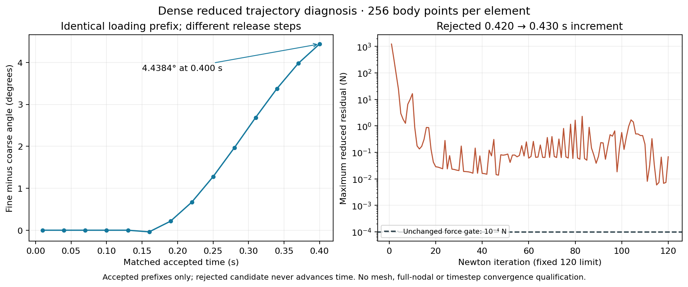

# Dense release rejection: frozen diagnostic checkpoint

This separate research lane preserves the original release-only refinement and its fresh replay. The release candidate remains frozen at `07e844a15aab68037a617310b7527b7af661771a`. Finite-bulk research `06e18acea7a8ae97d1d7f26fcec633119e137c77` remains an ancestor, with its exact source-linked book/proof/lab evidence unchanged. No book equation, Lean claim, material law, bulk value, contact parameter, solver implementation or acceptance tolerance changes in this checkpoint.

## Reproduced terminal result

The original dense release run shares exactly the first five accepted coarse loading states. It then uses release intervals of 0.01 s instead of 0.03 s, with 256 body points per element and the same 460-coordinate space. Fresh replay returns `PASS_PRESERVED_REJECTION` for all 34 retained states. The original execution's SHA-256 is `7a2d9aabf693d402b5e4275c9563742236ce06e64f48356a7f2cd2cd106869dd`.

The rejected target is 0.430 s from the retained old state at 0.420 s. The historical rejection replay row records the retained old time; this diagnostic explicitly recomputes the candidate target as old time plus the requested increment. The candidate has reduced and independently assembled residual 0.06832677997711717 N versus the unchanged 0.0001 N gate. Its best retained iteration residual was 0.005885159257290358 N, still 58.85 times the gate. It reached the fixed 120-iteration limit, added no new contact witnesses and never advanced the accepted state, time or contact recipe.

The candidate's minimum corner determinant is 0.9652448471686671, with zero transverse crossings, accepted routing and zero sampled muscle/bone, muscle/muscle and tendon/bone penetrations. The terminal rejection is a stationarity failure; it is not a failed recorded geometry gate. These sampled checks do not prove global contact feasibility or full tissue-envelope credibility.

## Matched-time evidence and the identical-pose probe

The accepted refined prefix differs from the accepted coarse run by −0.03898° at 0.160 s, +1.27451° at 0.250 s and +4.438401297017801° at 0.400 s. At 0.400 s, maximum actual P2 tissue-node displacement difference is 0.006957725825777878 m. Both residuals pass there: coarse 5.469302102568919e-5 N and fine 4.217794165725002e-5 N. This is a quantitative timestep/path difference, not timestep convergence acceptance.

At 0.430 s the native coarse accepted endpoint has residual 4.24802298708009e-5 N. It used seven Newton iterations, below the research control's 120-iteration limit. Its old state/velocity and physical endpoint differ from the rejected refined case, so those two native residuals cannot isolate timestep or solver causes by themselves.

The frozen probe instead holds the rejected coordinates, accepted old state, activation, mass, material integration and contact rule identical. Changing only the incremental objective's `h` from 0.01 to 0.03 s changes only the joint row/column: all non-joint gradient differences are exactly zero. Joint residual changes from 0.06832677997711717 to 55.87881770350799 N; joint Hessian change is −96716.46442313872 N/m. Its negative eigenvalue persists, changing from −177.81317238661225 to −179.64687941745166 N/m. The fixed-activation probe is an operator diagnostic, not a valid alternative physical increment or a coarser accepted trajectory.

## Curvature, conditioning and contact

The native coarse reduced Hessian has minimum eigenvalue +0.38906235227924557 N/m and maximum 76030907.39732713 N/m. The rejected refined candidate has one negative eigenvalue, −177.81317238660324 N/m, with maximum 76030923.59675452 N/m. The negative eigenvector's squared coefficient norm lies 99.999685% in `FJ1487` (brachioradialis). This local reduced direction is not a full-nodal stability result. The coarse operator is ill-conditioned in raw coordinate units; diagonal normalization is reported separately in the spectrum receipt.

Actual force differences along that direction converge to the analytic negative curvature. The initial 1e-6 m perturbation failed the unchanged 1e-4 relative derivative-agreement gate; its raw failure and checker bytes are preserved. All larger-increment disagreements remain in the refined receipt. At 1e-8 and 5e-9 m, relative errors are 2.7143e-7 and 1.0386e-7 respectively. No force acceptance gate was relaxed.

| Contribution along the same mode | Curvature (N/m) |
| --- | ---: |
| P2 tissue bodies | +43.40376974392451 |
| Other apparatus terms | +3.192204075659234 |
| Gravity, stops, inertia and damping | +0.24095421435653883 |
| Contact | −224.6501004205468 |
| Total | −177.8131723866065 |

Four diagnostic phase labels and a transparent Hessian-array observer split the actual contact additions without changing any energy/force/derivative arithmetic. Every assembled Hessian entry and incremental gradient equals the original saved bytes. Muscle-to-bone samples contribute −257.4978158334364 N/m; reciprocal bone-to-muscle samples contribute +32.84770782254489 N/m; tendon/bone and muscle/muscle contributions are only about 6.3e-6 and 1.3e-6 N/m. The local negative curvature therefore comes from the existing muscle/bone distance potential, not the constitutive bulk penalty or an omitted witness in this rejected increment.

## Controlled experiments and next justified solver work

Two bounded experiments are running separately and are excluded from this committed diagnostic verdict until terminal execution and fresh replay:

1. Retry the same rejected increment from the exact retained 0.420 s old state using the last two accepted dense states as a secant initial guess. The original archived 32-point guess moves the joint from 39.23035° to 33.52606° and changes a tissue coefficient by up to 7.5953 mm; the secant predictor gives 38.37183° and 1.3369 mm. No physical assumption or 120-iteration cap changes.
2. Repeat the last 0.400→0.430 s interval from one exact accepted coarse old state: one 0.03 s step versus three self-consistent 0.01 s steps. Both cases keep the same original mechanics and 120-iteration limit. The coarse initial guess matches the original archived seed; refined substeps use accepted-state secants. This separates accumulated trajectory history from the final interval, while recording the remaining seed distinction explicitly.

The evidence justifies testing a bounded search that can use negative curvature in the existing reduced potential, with the same geometry, force and iteration gates. A trust-region experiment is supported by [Steihaug's original PCG/trust-region paper](https://epubs.siam.org/doi/10.1137/0720042), whose publisher abstract and negative-curvature scope were verified; no paywalled full-text access is claimed. This is a proposed solver experiment, not an implemented change or a convergence guarantee. The current positive-curvature Newton/PCG path and scalar regularization must be distinguished from global contact infeasibility. More iterations, relaxed gates, contact-curvature removal or material retuning are not justified by this evidence.

Raw diagnostic/replay logs, frozen matrices, source-linked receipts, the preserved failed derivative check and PNG/PDF renders are under `data/anatomical-arm-v1/review/dense-release-rejection/`. Every production mechanics input matches the original execution's recorded sources. No skin, Library transfer, release push, deployment or general convergence acceptance occurred.
