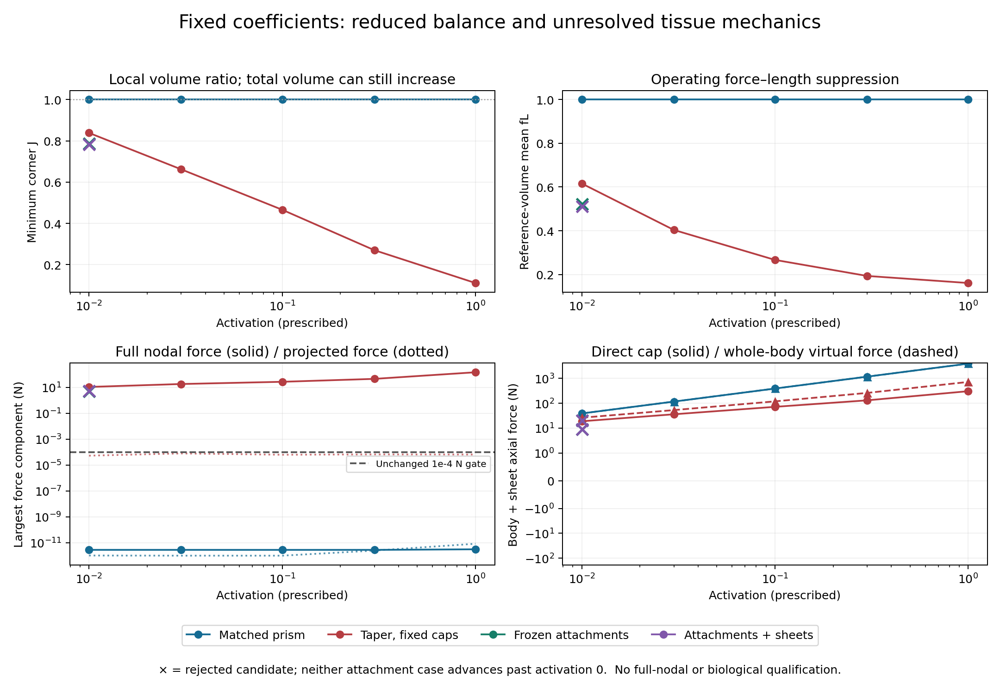

# Why a converged reduced force balance can still give an implausible muscle

The fixed-coefficient controls identify a numerical obstacle before a material change: the tapered short-biceps fixture can reach a local minimum in its 45-coordinate free displacement space while leaving **143.73 N** of unresolved free-P2 nodal force. Its smallest corner volume ratio falls to **J=0.1110**, even though total volume rises by 5.23%. The matched prism carries the same material and active coefficient with **J=1**, essentially zero free nodal force and the analytic axial reaction. Neither result validates the anatomical envelope, but their difference rules out interpreting a small projected residual as sufficient tissue equilibrium.

This is research text ready for a future book revision. It does not change the published teaching edition, its equations, material defaults or Lean claims. All four controls, their original failures and their fresh replays are retained. The [protocol](fixed-coefficient-control-protocol.md) defines the fixtures and gates; no completed lift/release trajectory was rerun.

## A controlled geometric comparison

The anatomical reference is **FJ1512, short head of right biceps brachii**, derived from BodyParts3D. The original database represents anatomical concepts through a whole-body adult-male model; it supplies anatomical geometry, not an individually measured muscle fiber or aponeurosis architecture ([Mitsuhashi et al., 2009](https://academic.oup.com/nar/article/37/suppl_1/D782/1000752)). This repository's remesh, centerline repairs, belly boundaries, fibers and embedded sheets remain explicitly authored approximations.

The prism extrudes the actual central polygon and scales its transverse area to match the retained head's volume **6.358895849884147e-5 m³** and declared length **0.14300694440018563 m**. Its area **444.6564 mm²** is geometric `V/L`, not measured PCSA. Prism and tapered head have identical 585-node/252-tetrahedron P2 connectivity, seven ring planes and the same 63 displacement coefficients. Both first controls use axial fibers, ideal fixed end caps, 45 free interior coefficients, no sheets and no contact. The intervention includes taper, cross-section variation and centerline geometry; it does not separately identify each geometric feature.

Every case keeps **mu=1000 Pa**, **K=1e6 Pa**, the passive-fiber law and the inherited short-biceps peak coefficient **sigma0=8.708387370104775 MPa**. The activation schedule is fixed in advance: **0, 0.01, 0.03, 0.1, 0.3, 1**. Body integration uses 256 positive points per element. The existing Newton algorithm retains its original 80 nonlinear/80 linear iteration limits and **1e-4 N** stationarity gate. Acceptance also requires independent full-P2 projection, assembly agreement, positive integration/corner determinants, finite coordinates and the specified cap constraints. Rejected candidates never advance the retained activation/state.

| Case | Terminal reduced outcome | Accepted activation | Independent reduced residual at terminal candidate | Full free nodal residual at candidate | Minimum corner J |
| --- | --- | ---: | ---: | ---: | ---: |
| Matched prism | All six stages freshly replayed | 1 | 8.40833e-12 N | 3.13142e-12 N | 1.000000 |
| Tapered head, ideal caps | All six stages freshly replayed | 1 | 6.48818e-5 N | 143.72905 N | 0.111010 |
| Tapered head, frozen authored attachments | First nonzero stage rejected and freshly preserved | 0 | 0.0244697 N at 0.01 | 5.10493 N | 0.788550 |
| Same attachments plus embedded sheets | First nonzero stage rejected and freshly preserved | 0 | 0.0187162 N at 0.01 | 5.37430 N | 0.782876 |

The last two rows describe **failed candidates**, not equilibrated sheet/support comparisons. Both exhausted the original 80-iteration budget. They preserve undeformed reference at activation zero. Their different candidate residuals or shapes cannot establish the equilibrium effect of adding a sheet. The targets, route guides, shared external sheet and joint are frozen at reference; this isolates an apparatus support map rather than reproducing the moving arm. No extra iterations, retuned coefficients or relaxed gates rescue these outcomes.

## Local compression is not the same as total volume loss

The tapered control already has **Jmin=0.838636** and a **10.5878 N** free nodal residual at activation 0.01. At 0.03, Jmin is **0.662039** and the nodal residual **17.8533 N**. At full activation, the reference-volume mean `fL` is **0.160749**, median stretch **0.615085**, and total volume ratio **1.052283**. Severe local compression is offset by expansion elsewhere. A near-unit global volume, or a positive determinant alone, cannot qualify the local tissue envelope.

For the current law,

\[
W=\frac\mu2(J^{-2/3}I_1-3)+\frac K2(\log J)^2+W_{\rm passive}(\lambda)+a\sigma_0\Phi(\lambda),
\qquad \Phi'(\lambda)=f_L(\lambda),\quad\lambda=|Ff_0|.
\]

The active first-Piola and Cauchy stresses are

\[
P_{\rm active}=a\sigma_0 f_L(\lambda)n\otimes f_0,
\qquad \sigma_{\rm active}=a\sigma_0 f_L(\lambda)\frac\lambda J n\otimes n.
\]

Thus the operating fiber-direction Cauchy scalar differs from `sigma0`; the tapered full-activation mean is **1.031919 MPa**, while the prism's undeformed uniform value is **8.708387 MPa**. The matrix term has zero mean Cauchy stress. The exact mean volumetric and active contributions are **K log(J)/J** and **a sigma0 fL(lambda) lambda/(3J)**. A finite bulk penalty does not enforce J=1, and the full-stretch active potential contributes to volumetric work. These identities identify an existing mechanism; they do not show that changing the potential or increasing K will produce a credible anatomy.

The prism needs zero Newton iterations at every stage: uniform axial stress has no lateral traction on its straight sides and no unbalanced interior nodal force. Its reaction is exactly **a sigma0 V0/L0**, reaching **3872.24051 N** at activation one. The same coefficients in the tapered restricted fixture induce nonuniform stretch, load transfer and local compression. Geometry, support and the displacement space must therefore be resolved before interpreting a fitted coefficient as a tissue property.

## Direct cap force and virtual work expose the missing equilibrium

Let `s` be normalized reference axial position and choose the dimensionless virtual field **phi=(1-s) referenceAxis**. It equals the axis at the distal cap and zero at the proximal cap. A displacement amplitude measured in metres gives a virtual-work derivative in newtons. We separately report signed direct distal nodal force and whole-body axial virtual force, split into active, passive-fiber, matrix/volume and sheet contributions.

At a full free-nodal equilibrium these totals should agree for this admissible field. At the tapered reduced full-activation state, direct body/sheet cap force is **302.86346 N**, while whole-body virtual force is **712.88429 N**. Their **410.02084 N** difference is unresolved free-node virtual work. The 45-coordinate Hessian is positive definite (minimum eigenvalue **414.2734 N/m**), so this example is locally stable in that restricted space; it is still neither stationary nor stability-qualified in the full nodal space.

The original stored calibration pose is preserved as a separate **frozen diagnostic**, with its authored fibers and sheets. Its 32-point generalized force exactly reproduces **435.581061 N**. At unchanged coordinates, independent 256-point projected residual is **1.662425 N**, full free-nodal residual **52.05886 N**, direct cap force **320.22214 N** and whole-body virtual force **435.83894 N**. Median fiber stretch is **0.590188**, mean `fL` **0.0850717**, and mean active fiber-direction Cauchy scalar **0.473038 MPa**. The fitted coefficient compensates for a strongly off-optimal and restricted fixture; these frozen fields are not a dense equilibrium calibration.

The active direct end contribution there is zero because the end-region fibers lie outside the active window, while active interior stress contributes **324.74045 N**, about **74.51%** of the total axial virtual force. Active stress transfers through the other terms. Zero direct active end force does not mean that the muscle has no active interior force. Conversely, virtual work at a failed full-nodal pose cannot substitute for a verified supported end reaction.

## What should change next, and what is not established

The completed trajectories' **6.94726 mm** matched-time nodal difference between seed histories remains unresolved. These controls show why force convergence alone cannot exclude implausible or initialization-sensitive shapes: the projection can suppress large excluded force components, and a positive restricted Hessian does not establish a unique full-space equilibrium. They do not causally assign that particular trajectory difference to geometry, contact history or a constitutive branch.

The next numerical revision should enrich the displacement space systematically, retaining fixed coefficients, quadrature, boundary data and budgets; test the enlarged projection and full nodal forces before any material refit. A direct physical end-reaction definition and its residual-dependent agreement with virtual work should become a calibration requirement. If a pressure/displacement formulation or new near-incompressibility treatment is then justified, it needs compatible spaces and convergence checks rather than a larger K chosen to hide an unfavorable shape.

Only after that should the active/volume coupling, shear response, fiber architecture and quasistatic stability be revised against source-backed benchmarks. Blemker, Pinsky and Delp model nearly incompressible muscle and use controlled architectural variations to explain nonuniform biceps strain; this supports separating numerical equilibrium from anatomical architecture rather than assuming uniform shortening ([2005](https://nmbl.stanford.edu/publications/pdf/Blemker2005.pdf)). Their findings do not supply measurements for this remesh or validate its authored sheets.

The inherited Arm26 targets also need the correct provenance: Holzbaur, Murray and Delp calculate peak forces from PCSA times specific tension, using **140 N/cm²=1.4 MPa** for elbow/shoulder muscles to match joint moment magnitudes ([2005, pp. 831–833](https://nmbl.stanford.edu/publications/pdf/Holzbaur2005.pdf)). These are model-derived force targets, not measured individual-head strengths. Neither that number nor the atlas geometric `V/L` alone selects a replacement coefficient. Any actual change to the current law would require rederived equations, derivative tests, new accepted calibrations/loaded trajectories and corresponding book and narrow Lean revisions. No such change, full-envelope acceptance or skin is made here.

Execution/replay JSON, failed candidates, full nodal forces and raw logs are under `audit/fixed-coefficient-*` and `review/fixed-coefficient-controls/`. The source-bound PNG/PDF render and frozen binary Hessian are retained. Fresh replay launches no optimizer, and all original source/evidence identities remain available for review.
