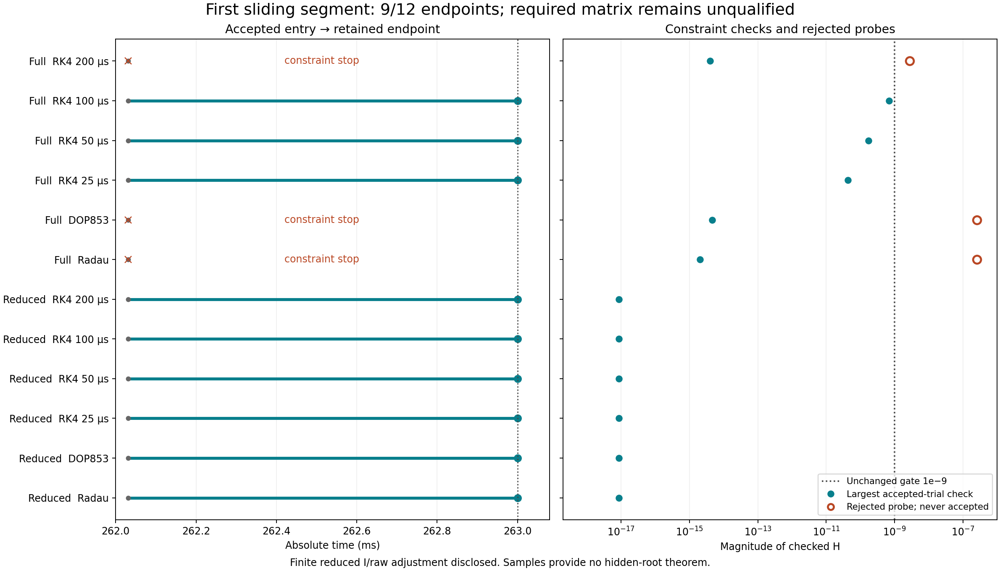

# First sliding segment: nine endpoints, required matrix unqualified

**Nine of twelve cells reached absolute .263 s. Three full-coordinate cells
stopped at entry on the unchanged 1e−9 constraint gate.** All 36 pairs among the
nine completed cells pass the original seven-state gates at each of the four
post-entry absolute witnesses. The required twelve-cell/66-pair matrix does not
complete and remains unqualified. No failed cell was retried, projected, omitted
or rescued by a tolerance change.

Source freeze: `30d3c9e6b80f6149df81fdae319b2da4fb39fd03`, tree
`f6259e1edb51f7079bf655537c63d9970a545215`.
Executable preflight: `2aceda1bbeb5b09f224a2bda909c99ef0a82c244`, tree
`ddf2e7e1d9f77f0ca50422f9598b36c68a527d06`.
Complete raw matrix, including all failures:
`e156a5076fd39a6e122e3346611e50e4ea4cf54a`, tree
`4a54ed2d9d16ef80df34756b798d7951d73b49cf`.
The [implementation freeze](first-sliding-segment-exploratory-source.md) records
source conventions, transactions and auxiliary/trajectory distinctions.

## Entry checks and finite handoff

[Fourteen tests](../../data/first-sliding-segment-exploratory-v1/preflight/tests.log)
and the [executable preflight](../../data/first-sliding-segment-exploratory-v1/preflight/entry-preflight.json)
passed. Each of twelve roots came from its own original incoming polynomial,
localized to width≤1e−12 s and |H|≤1e−13 within the unchanged 32-bisection budget.
Native/full and independent/reduced lifted RHS and tangent disagreement were at
most 8.2409079560e−13; all strict signs, decoding, zero Jacobian ledger columns
and rollback checks passed. All 66 pairs passed original absolute 0..262 ms
comparisons and original event-order/time gates before any entry was accepted.
Attracting entry-time span was 8.15838574475e−9 s versus the 2e−6 s gate.
The [runtime checks](../../data/first-sliding-segment-exploratory-v1/review/runtime-entry-checks.json)
repeat all proposed-entry checks before the first entry acceptance.

Full coordinates retain incoming I exactly. Reduced coordinates preserve the
other four physical and six ledger coordinates bitwise and reconstruct I from
`B−ub−.4e`; maximum signed I/raw adjustment magnitude was
1.51718915209e−14 under the original 1e−9 coordinate gate. Reduced handoff is
**not exact eleven-coordinate continuity**; all six reduced I adjustments are
nonzero. Historical ledgers/quadrature are retained, incoming prefixes are
certified, and all old trial suffixes are discarded.

## Outcomes and the actual constraint blocker

| Method | Full-coordinate outcome | Reduced-coordinate outcome |
| --- | --- | --- |
| RK4 200 µs | Entry only; first midpoint rejected, H magnitude 2.77851120410e−9 | .263 s; 5 sliding steps |
| RK4 100 µs | .263 s; 10 sliding steps | .263 s; 10 sliding steps |
| RK4 50 µs | .263 s; 20 sliding steps | .263 s; 20 sliding steps |
| RK4 25 µs | .263 s; 39 sliding steps | .263 s; 39 sliding steps |
| DOP853 | Entry only; initialization probe rejected, H magnitude 2.60398982677e−7 | .263 s; 2 sliding steps |
| Radau | Entry only; initialization probe rejected, H magnitude 2.60398696482e−7 | .263 s; 3 sliding steps |

The [rejected-state diagnosis](../../data/first-sliding-segment-exploratory-v1/review/constraint-stop-diagnosis.json)
reevaluates already rejected states using unchanged native and independent
kernels. Force residuals, taut tendon/fiber bounds, outward error, strict normal
signs, convex weights and activation side all remain valid there. Their H
residuals exceed the declared gate. This identifies a numerical constraint
failure, not a demonstrated constitutive/force-domain failure.

The [recorded-rate associations](../../data/first-sliding-segment-exploratory-v1/review/matched-witness-summary.json)
show each rejected vector is bitwise equal to its declared Euler predictor.
RK4 fails at `old+(h/2)*initial_RHS`, with h/2 exactly .0001 s. The first static
diagnosis used `failedTime−entryTime`, which rounds to
.00009999999999998899 s; its tiny nonzero vector discrepancy is preserved,
while the supplemental declared-step association has exact zero discrepancy.

Both adaptive methods fail in their constructors' initial-step selection Euler
RHS probe at .263, **before the first solver step**. Its .969265 ms offset
is an initialization estimate rather than an accepted adaptive step. A
`failedStageTime=.263` therefore does not mean either cell reached that endpoint;
accepted time remains approximately .262030734 s. No initial-step override was
introduced after seeing these failures.

The full RK4 100/50/25 µs largest checked accepted-trial |H| values are
6.94723977998e−10, 1.73689207114e−10 and 4.34309688907e−11.
The ratios are approximately 3.99981 and 3.99920. These observations are
consistent with the quadratic intermediate-predictor constraint error on a
nonlinear surface. They are a diagnostic inference, **not** a global solution
order, convergence or hidden-root theorem. No new physical law, field, gain,
constraint projection, integration policy or exit convention follows from them.
The current frozen integration/stage policy cannot complete the required matrix;
a changed numerical policy would need a separately reviewed freeze.

All three rejected trials retain their entry state, accepted time, historical
quadrature and ledgers exactly. They have zero accepted sliding intervals and no
post-entry witness coverage. The [matrix log](../../data/first-sliding-segment-exploratory-v1/review/matrix.log)
and all twelve raw result files retain successful and failed cases.

## Independent replay and matched-time evidence

The [independent audit](../../data/first-sliding-segment-exploratory-v1/review/audit.json)
checks 160 new accepted incoming-prefix/sliding polynomials, 1,280 GL8 points
and 630 RHS evaluations attached to successful trials, using its own polynomial
evaluator and original independent force/curve kernels. **RHS evaluations are
unaccepted probes**, including solver initialization/dense/error-control queries;
the count is not a count of accepted orbit points. Rejected trials and separately
labeled Jacobian auxiliaries do not enter quadrature or accepted history.
Every actual ODE RHS evaluation retains the stage gates; only finite-difference
Jacobian auxiliaries exclude constraint/ledger checks as declared in the freeze.

All twelve accepted-prefix replay audits pass original force, constraint,
normal/tangent, cumulative/segment work and impulse checks. Largest directly
stored primary force residual is 3.55271367880e−15 N. Largest independent normal
disagreement is 2.38529265784e−10/s and tangent residual is
1.02279296144e−12/s, both below 1e−8/s. Maximum cumulative/segment work diagnostic
across checked trial probes is about 4.6334e−6 J below 1e−5 J; it includes
unaccepted adaptive initialization probes and is not a continuous trajectory
energy-error bound. Maximum cumulative GL8 ledger discrepancies are
[1.75563e−11,7.92560e−12,6.57197e−12,2.88358e−11,1.03604e−11] J
and 3.57914e−11 N*s, below unchanged gates.

At absolute .26225/.2625/.26275/.263 s, all **36 completed pairs** pass. Worst
completed-pair post-entry errors are:

| Quantity | Maximum error | Original gate |
| --- | --- | --- |
| y | 1.32264720010e−11 m | 1e−6 m |
| w | 1.32631144956e−9 m/s | 1e−5 m/s |
| a | 4.49369564129e−10 | 2e−6 |
| q | 6.92927937251e−11 | 2e−6 |
| tendon force | 4.48687274002e−8 N | 1e−4 N |
| I | 1.79476069423e−10 | 1e−9 |
| raw | 8.12197531452e−15 | 1e−8 |

The [matched-witness tables](../../data/first-sliding-segment-exploratory-v1/review/matched-witness-summary.json)
retain signed samples, remaining margins, all 66 required pair records, and
adjacent RK differences/ratios. The 30 incomplete pairs remain failed for
completion; available incoming-prefix agreement does not qualify them.
There is no event-time alignment, anchor correction or removal of a coarse
level. Inherited incoming errors and incomplete full-coordinate adaptive
references prevent any full-order/global-convergence inference.

The [SVG](../../data/first-sliding-segment-exploratory-v1/review/segment-outcome.svg)
and 2380×1360 PNG were inspected visually: all twelve labels are readable,
rejected probes are hollow and explicitly unaccepted, the unchanged gate is
visible, and the title states that the matrix is unqualified.

## Preservation and remaining scope

[Verification](../../data/first-sliding-segment-exploratory-v1/review/packet-verification.log)
confirms all 152 immutable input bindings, six frozen implementation sources,
2,086 baseline blobs, exact failed-trial rollback and preserved branch tips.
The first-sliding protocol stays b692d372, combined incoming stays c1c7ba3,
scalar Lean proofs stay 9547246e and activation proofs stay 4da4eccc. The
[preliminary failed Jacobian-ledger test](../../data/first-sliding-segment-exploratory-v1/attempts/manifest.json)
and its source are preserved. Execution commands, exit codes, runtime versions
and render review are in the [execution receipt](../../data/first-sliding-segment-exploratory-v1/review/execution-and-render.json).
A successful command exit means evidence was produced; the matrix outcome is
explicitly false.

Both independent external raw-review gaps remain disclosed: the new combined
incoming result's full external raw replay was unavailable after transfer
cancellation, and historical activation raw replay is incomplete. No transfer
retry/reroute or external review request was made. Sampling provides no hidden-root
exclusion theorem. The scalar result does not resolve anatomical bulk/compression,
self-consistent spatial dense lift/release or nodal/quadrature/timestep convergence.
No skin, production/anatomical qualification, new physical law, book adoption,
main merge or deployment is claimed or performed.
